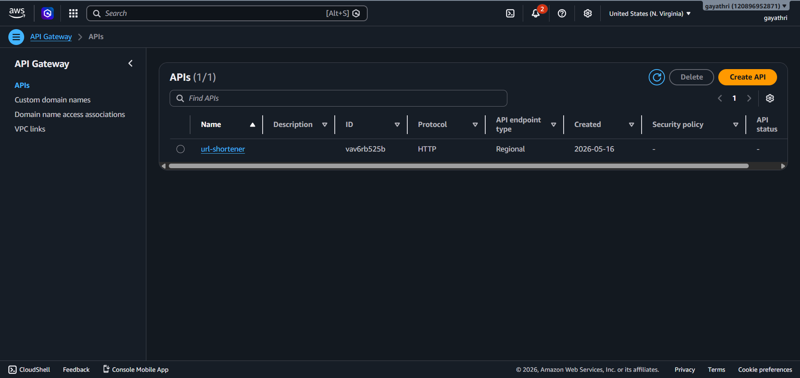
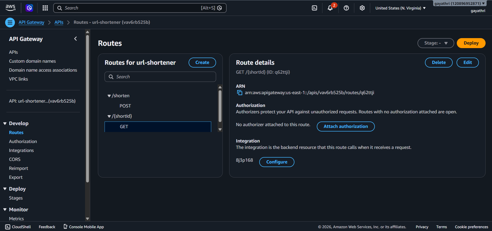
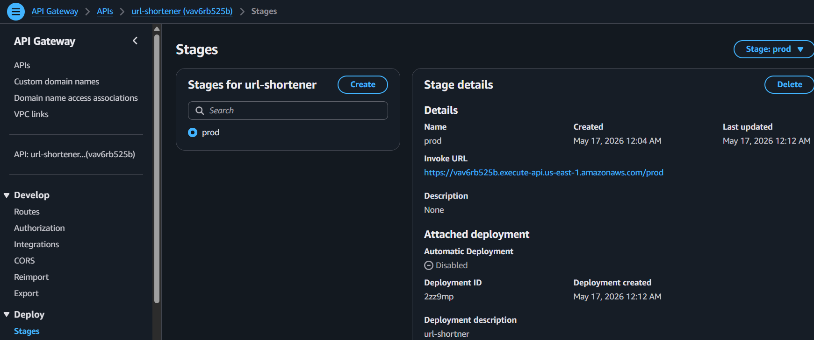
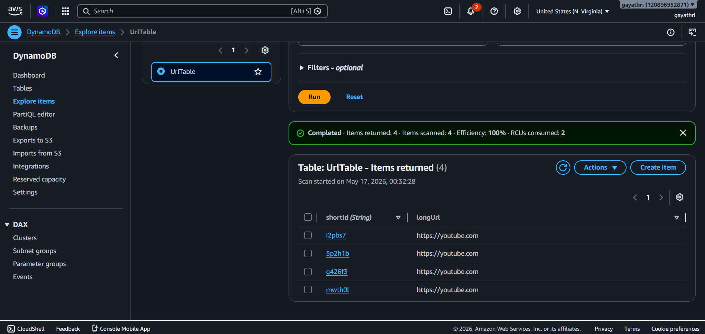
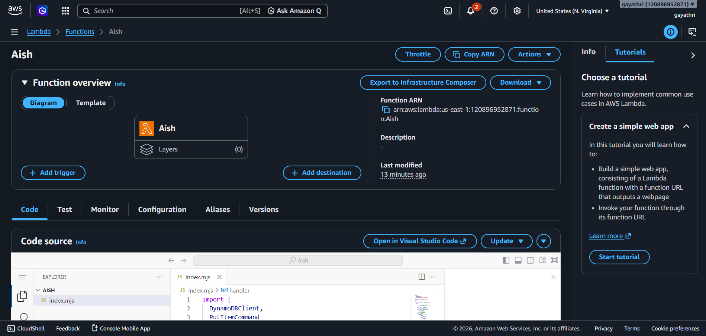
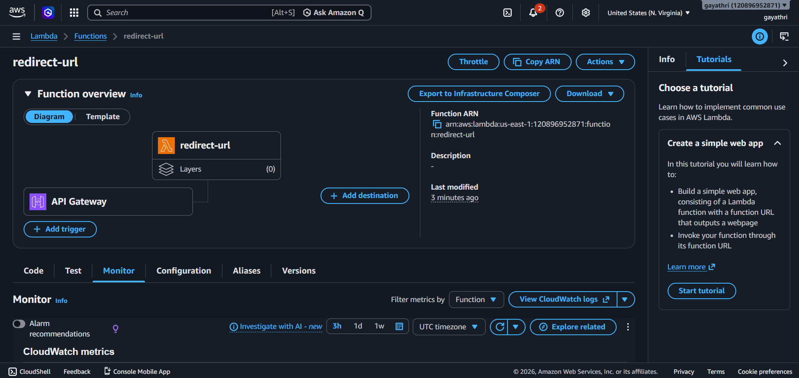

# AWS Serverless URL Shortener


This project demonstrates how to build a fully serverless application using:

- AWS Lambda
- Amazon API Gateway
- Amazon DynamoDB
- Node.js

---

# 🚀 Features

- Create short URLs
- Redirect users using short URLs
- Fully serverless architecture
- Uses AWS managed services
- Beginner-friendly cloud project

---

# 🛠️ Tech Stack

- Node.js
- AWS Lambda
- Amazon API Gateway
- Amazon DynamoDB

---

# 📌 Architecture

```text
User
  ↓
API Gateway
  ↓
POST /shorten ──→ shorten-url Lambda ──→ DynamoDB
  ↓
GET /{shortId} ─→ redirect-url Lambda ─→ DynamoDB


---

# 📸 Project Screenshots

## API Gateway Overview



---

## API Gateway Routes



---

## API Gateway Stages



---

## DynamoDB Table



---

## IAM Roles


---

## URL Shortener Lambda Function



---

## Redirect Lambda Function



---
