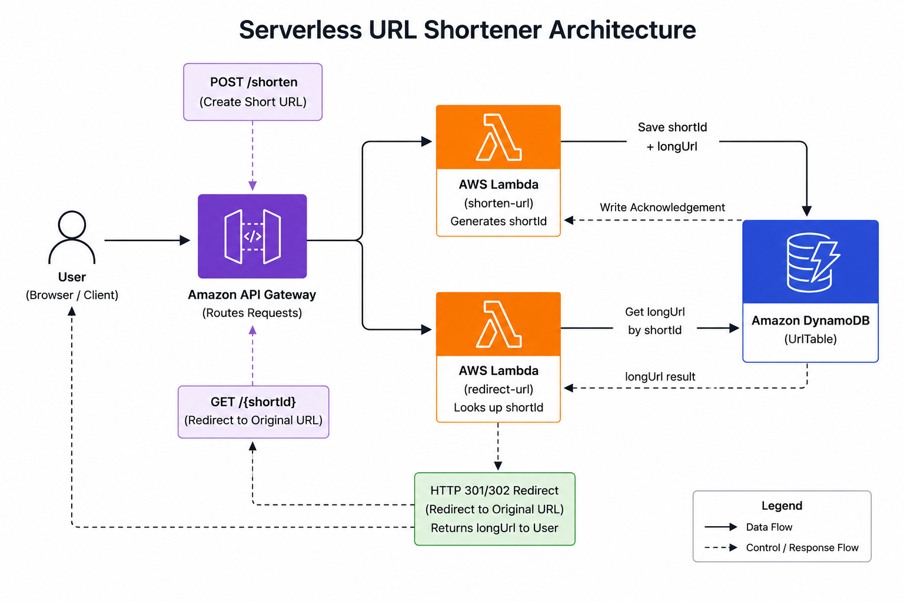

# AWS Serverless URL Shortener

A beginner-friendly serverless URL shortener built using AWS services and Node.js.

This project demonstrates how to build a fully serverless application using:

- AWS Lambda
- Amazon API Gateway
- Amazon DynamoDB
- Node.js

---

# 🚀 Features

- Create short URLs
- Redirect users using short URLs
- Fully serverless architecture
- REST API using API Gateway
- DynamoDB integration
- Beginner-friendly AWS project

---

# 🛠️ Tech Stack

- Node.js
- AWS Lambda
- Amazon API Gateway
- Amazon DynamoDB
- IAM
- CloudWatch Logs

---

# 📌 Architecture Flow

```text
User
  ↓
Amazon API Gateway
  ↓
POST /shorten ──→ shorten-url Lambda ──→ DynamoDB
  ↓
GET /{shortId} ─→ redirect-url Lambda ─→ DynamoDB
  ↓
HTTP 302 Redirect to Original URL
```

---

# 📂 Project Structure

```text
URLSHORTNER/
│
├── images/
│   ├── apigateway_route.png
│   ├── apigateway_stages.png
│   ├── dynamodb.png
│   ├── gatewayapi.png
│   ├── iam roles.png
│   ├── lambda_redirect_function.png
│   └── lambda_serverless_url.png
│
├── redirect-url/
│   └── index.mjs
│
├── shorten-url/
│   └── index.mjs
│
├── package.json
├── package-lock.json
├── .gitignore
└── README.md
```

---

# ⚡ API Endpoints

## 1️⃣ Create Short URL

### Endpoint

```http
POST /shorten
```

### Request Body

```json
{
  "url": "https://youtube.com"
}
```

### Response

```json
{
  "message": "Short URL created successfully",
  "shortId": "abc123",
  "shortUrl": "https://your-api-url/abc123"
}
```

---

## 2️⃣ Redirect URL

### Endpoint

```http
GET /{shortId}
```

### Example

```text
/abc123
```

This endpoint redirects the user to the original long URL using HTTP 302 redirect.

---

# 🗄️ DynamoDB Configuration

## Table Name

```text
UrlTable
```

## Partition Key

```text
shortId (String)
```

---

# ☁️ AWS Services Used

| Service | Purpose |
|---|---|
| AWS Lambda | Backend serverless functions |
| API Gateway | REST API endpoints |
| DynamoDB | NoSQL database |
| IAM | Permissions management |
| CloudWatch | Logs and monitoring |

---

# 📸 Project Screenshots
## Architecture Diagram

---
## API Gateway Overview


---

## API Gateway Routes


---

## API Gateway Stages


---

## DynamoDB Table


---

## IAM Roles


---

## URL Shortener Lambda Function


---

## Redirect Lambda Function


---

# 📖 Learning Outcomes

This project helped in understanding:

- Serverless architecture
- API Gateway routing
- Lambda triggers
- DynamoDB integration
- HTTP redirects
- IAM permissions
- CloudWatch logging
- AWS cloud fundamentals

---


# 👩‍💻 Author

Aishwarya

---

# 📜 License

This project is for learning and educational purposes.